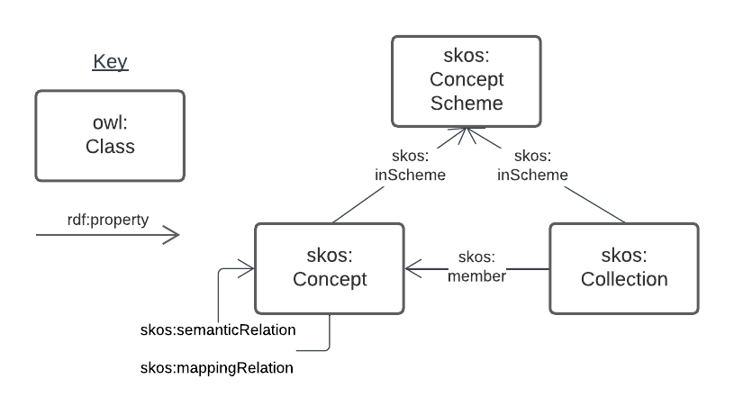

= ISO SKOS Vocabulary Profile - Specification
:toc: left
:table-stripes: even
:sectnums:

NOTE: DRAFT, incomplete

== Metadata

[width=75%, frame=none, grid=none, cols="1,5"]
|===
|**IRI** | https://w3id.org/profile/iso-skos/spec
|**Title** | ISO SKOS Vocabulary Profile - Specification
|**Definition** | This document lists the normative requirements for data aiming to conform to the https://w3id.org/profile/iso-skos[ISO SKOS Vocabulary Profile]. It is to be used as the authoritative, human-readable, list of individual requirements from which other profile artifacts, such as data validators, are derived.
|**Created** | 2022-03-25
|**Modified** | 2022-04-22
|**Version** | 1.0.0
|**Creator** | ISO Technical Committee 211's Advisory Group 6
|**Publisher** | _not officially published_
|**License** | _not licensed for use_
|**Further information** | This specification document is one resource of many within the ISO SKOS Vocabulary Profile. See section <<Standard Parts>> below for more details of the other parts and how this Specification related to them. See also the profile's https://w3id.org/profile/iso-skos[overview document].
|===

== Preamble

=== Abstract

This document lists the normative requirements for data aiming to conform to the https://w3id.org/profile/iso-skos[ISO SKOS Vocabulary Profile]. It is to be used as the authoritative, human-readable, list of individual requirements from which other profile artifacts, such as data validators, are derived.

=== Normative Status

This Specification is normative for the ISO SKOS Vocabulary Profile and its directives take precedence over other elements of the Profile where conflicts are found.

=== Standard Parts

This specification document is one resource of many within the ISO SKOS Vocabulary Profile. The Profile, which forms a Standard, and its parts are formally defined using terminology from the _Profiles Vocabulary_ <<PROF>>.

Other parts of this _Standard_ are:

* _Overview_
** the guidance document of this profile
** <https://w3id.org/profile/iso-skos>
* _Validators_
** machine-readable validation code to validate data claiming conformance to the ABIS
* _Examples_
** Examples of RDF data to show how to formulate BDR information
* _Mappings_
** Instructions on how to convert BDR data to data conformaing to other Standards

The formal and linked listing of this Standards's parts is found in its _Profile Declaration_ online at link:https://linked.data.gov.au/def/abis[Australian Biodiversity Information Standard].

In addition to the "technical" parts, this Specification describes the conceptual parts of ABIS, in particular, the domain model and other non-domain models.

=== Namespaces

[width=75%, frame=none, grid=none]
|===
|Prefix | Namespace | Description

| `req:` | `https://w3id.org/profile/iso-skos/req/` | For _equirements_ of this _profile_
|`dcterms:` | `http://purl.org/dc/terms/` | Dublin Core Terms vocabulary namespace
|`ex:` | `http://example.com/thing` | Generic examples namespace
|`owl:` | `http://www.w3.org/2002/07/owl#` | Web Ontology Language ontology namespace
|`rdfs:` | `http://www.w3.org/2000/01/rdf-schema#` | RDF Schema ontology namespace
| `sdo:` | `https://schema.org/` | schema.org vocabulary namespace
|`skos:` | `http://www.w3.org/2004/02/skos/core#` | Simple Knowledge Organization System (SKOS) ontology namespace
|`status:` | `http://def.isotc211.org/iso19135/-1/2015/code/RE_ItemStatus/` | ISO19135-1:2015 Registry Status Codes
|`void:` | `http://rdfs.org/ns/void#` | Vocabulary of Interlinked Data (VoID) ontology namespace
|`xsd:` | `http://www.w3.org/2001/XMLSchema#` | XML Schema Definitions ontology namespace
|===

=== Terms & Definitions

The following terms are used throughout this Specification document and, where they are, these definitions apply. They are italicized within the text for identification and often capitalized when referring to a specific instance.

IRI:

    "Internationalized Resource Identifier... is a complement to the Uniform Resource Identifier (URI)""

    "IRIs can be used instead of URIs, where appropriate, to identify resources"

[width=75%, frame=none, grid=none, cols="1,4"]
|===
| Scope Note | In this document, IRIs are used to identify _requirements_, this document itself and various other _profile resources_. IRIs are intended to resolve on the Internet, although this is not strictly necissary: they can be used to just indicate universal identify 
| Source | <<IETF3987>>
|===

ontology::

    In computer science and information science, an ontology encompasses a representation, formal naming, and definition of the categories, properties, and relations between the concepts, data, and entities that substantiate one, many, or all domains of discourse.

    The word ontology was originally defined as "the branch of philosophy that studies concepts such as existence, being, becoming, and reality". and the computer science term is derived from that definition.

[width=75%, frame=none, grid=none, cols="1,4"]
|===
| Provenance | Defined here but derived from common use of the word
|===

profile::

    "A specification that constrains, extends, combines, or provides guidance or explanation about the usage of other specification"

[width=75%, frame=none, grid=none, cols="1,4"]
|===
| Scope Note | This document is the _Specification Document_ that defines the rules for this _Profile_
| Source | <<PROF>>
|===

requirement::

    Rules to which data claiming conformance to this profile must obey

[width=75%, frame=none, grid=none, cols="1,4"]
|===
| Scope Note | _Requirements_ in this _Specification_ are identified with persistent web identifiers and the impertive nature of the _requirement_ is indicated according to <<IETF2119>>
| Provenance | Defined here but derived from <<PROF>>'s and <<IETF2119>> use of the term
|===

resource::

    An information resource (document/file)

[width=75%, frame=none, grid=none, cols="1,4"]
|===
| Scope Note | When describing _resources_ of a _profile_, the term _profile resource_ is used
| Provenance | Defined here but derived from <<PROF>>'s use of the term
|===

Semantic Web::

    The https://www.w3.org/[World Wide Web Consortium]'s vision of an Internet-based web of Linked Data.

    Semantic Web is used to refer to something more than just the technologies and conventions of Linked Data; the term also encompases a specific set of interoperable data models - often called ontologies - published by the W3C, other standards bodies and some well-known companies.

    The 'semantic' refers to the strongly-defined nature of the elements in the Semantic Web: the meaning of Semantic Web data is as precicely defined as any data can be.

[width=75%, frame=none, grid=none, cols="1,4"]
|===
| Provenance | Defined here but derived from https://www.w3.org/standards/semanticweb/
|===

specification document::

    "Defining the profile in human-readable form"

[width=75%, frame=none, grid=none, cols="1,4"]
|===
| Scope Note | This is a role played by a _resource_ within the _profile_. This role indicates authoritativeness
| Source | <<PROF>>
|===

== Introduction

This document contains rules, names _requirements_ that must be obeyed by data wishing to claim conformance to this profile. The _requirements_ are identified with persistent web identifiers (IRIs)

NOTE: This document does not contain all of the information in this profile. See the https://w3id.org/profile/iso-skos[Profile Declaration] for a listing of all profile parts and their roles.

=== Purpose

The purpose of this _profile_ is to ensure that _Seamntic Web_ vocabularies created for use by the ISO's TC211 contain elements (data and metadata) that allow for unabiguous concept definitions and concept versioning and other forms of management.

=== Profile Inheritance

This _profile_ profiles the <<SKOS>> data model and thus all data claiming conformance to this _profile_ must also conform to rules deined by SKOS.

NOTE: As of 2022, SKOS does not present _requirements_ in a machine-readable form as this _profile_ does thus SKOS conformance may be hard to establish.

The SKOS data model is quite flexible - many different 'styles' of vocabulary may be created using it - however this can result in very diffently constituted vocabularies that are technically difficult to manage. For this reason, this profile constrains the use of SKOS to one particular 'style' that is best undestood by reviewing the _requriements_ below.

=== SKOS data model

Vocabularies constituted according to this _profile_ will essentially be <<SKOS>> vocabularies, sometimes called taxonomies, that contain instances of SKOS' classes of object and SKOS relationshipes between them. The will also contain properties not defined by SKOS but by other Semantic Web _ontologies_ that are either expected for use with SKOS or, if not expected, are able to be used with SKOS without breaking any SKOS or the other ontology's rules. This is an expected _Semantic Web_ practice.

[id=skos-model-basic]
.Top-level elements of the SKOS data model. Derived from <<SKOS>>

While SKOS provides a couple of classes and many properties not shown in <<skos-model-basic, Figure 1>>, this profile requires use of only a few of them, as per the _requirements_ below.

For examples of SKOS data, please see <<SKOS>> and also the ISO TC 211's experimental codelist vocabularies:

* https://github.com/ISO-TC211/GOM/tree/master/experimental/codelist-vocabularies

=== Validation

The _requirements_ below have correlating data 'shapes' - graph pattern matching queries - in the validation _resources_ of this _profile_ that can be used in an automated manner to check the conformance of data to this _profile_. See the https://w3id.org/profile/iso-skos[Profile Declaration] for details.

== Requirements

_Requirements_ for this specification are organised per the major classes of the SKOS data model, as overviewed in <<skos-model-basic, Figure 1>> with additional requirements for vocabularies as a whole and for the representation of Agents, that is people and organizations with relations to vocabularies.

NOTE: These _requirements_ define the minimum vocabulary elements and properties necissary for data to conform to this profile. Other elements (likely RDF properties) from SKOS or other _Semantic Web_ _ontologies_ may be used, as long as they do not conflict with these _requirements_.

=== Vocabulary

[cols="1,3,6,8"]
|===
| ID | Title | Rule | Notes

| https://w3id.org/profile/iso-skos/req/1.1[req:1.1] | Vocab IRI | Each vocabulary _MUST_ be identified by a IRI | 

| https://w3id.org/profile/iso-skos/req/1.3[req:1.3] | Vocab Single File | Each vocabulary _MUST_ be presented in a single file which does not contain information other than that which is directly part of the vocabulary and the file is considered the point-of-truth | For ease of data management

| https://w3id.org/profile/iso-skos/req/1.2[req:1.2] | Vocab ConceptScheme | Each vocabulary _MUST_ be represented with a single `skos:ConceptScheme` object | Within the vocabulary file:
|===

=== Concept Scheme Class

As per <SKOS-RIMER>>, a document guiding the use of SKOS:

[quote]
concepts usually come in carefully compiled vocabularies, such as thesauri or classification schemes. SKOS offers the means of representing such KOSs using the `skos:ConceptScheme` class.

[cols="1,3,6,8"]
|===
| ID | Title | Rule | Notes

| https://w3id.org/profile/iso-skos/req/2.1[req:2.1] | ConceptScheme Title | Each `skos:ConceptScheme` _MUST_ have one and only one title indicated using the `skos:prefLabel` property that must be a text literal value | To ensure vocabularies can be catalogued effectively and governed

| https://w3id.org/profile/iso-skos/req/2.2[req:2.2] | ConceptScheme Definition | Each `skos:ConceptScheme` _MUST_ have one and only one definition value indicated using the `skos:definition` property that must be a text literal values |

| https://w3id.org/profile/iso-skos/req/2.3[req:2.3] | ConceptScheme Created Date | Each `skos:ConceptScheme` _MUST_ have one and only one created date and one and only one modified date indicated using the `sdo:dateCreated` and `sdo:dateModified` properties respectively that must be an `xsd:date`, `xsd:dateTime` or `xsd:dateTimeStamp` literal value | 

| https://w3id.org/profile/iso-skos/req/2.3[req:2.4] | ConceptScheme Creator | Each `skos:ConceptScheme` _MUST_ have at least one creator and at least one publisher, indicated using `sdo:creator` & `sdo:publisher` properties respectively that must be IRIs value indicating an instance of `sdo:Person`, `sdo:Organization` | 

| https://w3id.org/profile/iso-skos/req/2.6[req:2.6] | ConceptScheme Provenance | Each `skos:ConceptScheme` _MUST_ be indicated by at least one of the following properties: `dcterms:provenance`, `dcterms:source` or `prov:wasDerivedFrom` | To be able to link SKOS vocabularies to their non-vocabulary source information.

If a vocabulary is based on another Semantic Web resource, such as an ontology or another vocabulary, prov:wasDerivedFrom should be used to indicate that resource's IRI. If the vocabulary is based on a resource that is identified by a IRI but which is not a Semantic Web resource, dcterms:source should be used to indicate the resource's IRI. If the vocabulary is based on something which cannot be identified by IRI, a statement about the thing should be given in a literal value indicated with the dcterms:provenance property. If the vocabulary is not based on any other resource or source of information, i.e. this vocabulary is its only expression, this should be communicated by use of the dcterms:provenance indicating the phrase "This vocabulary is expressed for the first time here".

| https://w3id.org/profile/iso-skos/req/2.7[req:2.7] | ConceptScheme Hierarchy | All `skos:Concept` instances linked to a `skos:ConceptScheme` via `skos:inScheme` _MUST_ be ordered in a single, term hierarchy using `skos:broader` and/or `skos:narrower` properties and contain no borader/narrower cycles |

| https://w3id.org/profile/iso-skos/req/2.8[req:2.8] | ConceptScheme Status | Each `skos:ConceptScheme` _MUST_ indicate its publication status according to the ISO TC 211 by use of the `reg:status` property indicating status values taken from the Statuses Vocabulary within this _profile_ | See the https://w3id.org/profile/iso-skos[Profile Declaration] for details about the Status Vocabulary

| https://w3id.org/profile/iso-skos/req/2.9[req:2.9] | ConceptScheme Version | Each `skos:ConceptScheme` _MUST_ indicate its version using the property `owl:versionIRI` with an IRI object | For vocabularies based on ISO TC 211 Standards, the IRI of the vocabulary with an additional element of a token identifier of the standard may be used.

| https://w3id.org/profile/iso-skos/req/2.10[req:2.10] | ConceptScheme Rights | Each `skos:ConceptScheme` _MUST_ present a rights holding information for it indicated with the properties `sdo:copyrightHolder`, `sdo:copyrightNotice` and `sdo:copyrightYear`. `sdo:copyrightHolder` must be the text "International Organization for Standardization", `sdo:copyrightNotice` must be "&copy; International Organization for Standardization, {YEAR}" where {YEAR} is the value of `sdo:copyrightYear` |

| https://w3id.org/profile/iso-skos/req/2.10[req:2.11] | ConceptScheme License | Each `skos:ConceptScheme` _MUST_ present a license for its use indicated with the `sdo:license` property indicating the IRI of a license using the datatype `xsd:anyURI` | Appropriate licensing is still to be determined by the ISO TC 211.
|===

Note that Concepts within a Concept Scheme, indicated by the use of the `skos:inScheme` property do not have to be defined in one vocabulary - any valid `skos:Concept` instance that conforms to this _profile_ is acceptable.

=== Collection Class

From the <<SKOS-PRIMER>>:

[quote]
SKOS makes it possible to define meaningful groupings or "collections" of Concepts

[cols="1,3,6,8"]
|===
| ID | Title | Rule | Notes

| https://w3id.org/profile/iso-skos/req/3.1[req:3.1] | Collection Title | Each `skos:Collection` instance _MUST_ have one and only one title indicated using the `skos:prefLabel` property that must be a text literal value | To ensure that `skos:Collection` instances are identifiable and their meaning isn't obscure or lost

| https://w3id.org/profile/iso-skos/req/3.2[req:3.2] | Collection Definition | Each `skos:Collection` instance _MUST_ have one and only one definition indicated using the `skos:definition` property that must be a text literal value | 

| https://w3id.org/profile/iso-skos/req/3.2[req:3.2] | Collection Provenance | Each `skos:Collection` instance _SHOULD_ indicate provenance with at least one of the following properties: `dcterms:provenance`, `dcterms:source` or `prov:wasDerivedFrom` if the `skos:Collection` is derived from an existing resource |
|===

Note that Concepts within a Collection, indicated by the use of the `skos:member` property do not have to be defined in one vocabulary - any valid `skos:Concept` instance that conforms to this _profile_ is acceptable.

=== Concept Class

From the <<SKOS-PRIMER>>:

[quote]
The fundamental element of the SKOS vocabulary is the concept. Concepts are the units of thought — ideas, meanings, or (categories of) objects and events—which underlie many knowledge organization systems

[cols="1,3,6,8"]
|===
| ID | Title | Rule | Notes

| https://w3id.org/profile/iso-skos/req/4.1[req:4.1] | Concept Title | Each `skos:Concept` instance _MUST_ have one and only one title per language indicated using the `skos:prefLabel` property that must be n `rdf:langString` value | To ensure that `skos:Concept` instances are identifiable in different languages

| https://w3id.org/profile/iso-skos/req/4.2[req:4.2] | Concept Definition | Each `skos:Concept` instance _MUST_ have one and only one definition indicated using the `skos:definition` property that must be a text literal value | 

| https://w3id.org/profile/iso-skos/req/4.3[req:4.3] | Concept IsDefinedBy | Each `skos:Concept` in a vocabulary _MUST_ indicate the vocabulary that defines it by use of the rdfs:isDefinedBy property indicating a `skos:ConceptScheme` instance | To ensure that every `skos:Concept` is linked to the vocabulary that defines it. `skos:Concept` instances may be reused across multiple vocabularies

| https://w3id.org/profile/iso-skos/req/4.4[req:4.4] | Concept InScheme| Each `skos:Concept` in a vocabulary _MUST_ indicate that it appears within that vocabulary's hierarchy of terms by use of either or both `skos:inScheme` and `skos:topConceptOf` properties | Since a `skos:Concept` may be used in more than one vocabulary

| https://w3id.org/profile/iso-skos/req/4.5[req:4.5] | Concept Provenance | Each `skos:Concept` instance _SHOULD_ indicate provenance with at least one of the following properties: `dcterms:provenance`, `dcterms:source` or `prov:wasDerivedFrom` if the `skos:Concept` is derived from an existing resource |

| https://w3id.org/profile/iso-skos/req/4.6[req:4.6] | Concept Status | Each `skos:Concept` _MUST_ indicate its publication status according to the ISO TC 211 by use of the `reg:status` property indicating status values taken from the Statuses Vocabulary within this _profile_ | See the https://w3id.org/profile/iso-skos[Profile Declaration] for details about the Status Vocabulary. These statuses may or may not be the same as the ConceptScheme(s) that this Concept is within
|===

=== Agent Class

Agents are people or organizations with roles relating to vocabularies. Agents are indicated for a vocabulary with the `sdo:creator` and `sdo:publiser` properties.

[cols="1,3,6,8"]
|===
| ID | Title | Rule | Notes

| https://w3id.org/profile/iso-skos/req/5.1[req:5.1] | Agent Type | Each Agent _MUST_ be typed as an `sdo:Person`, `sdo:Organization` | 

| https://w3id.org/profile/iso-skos/req/5.2[req:5.2] | Agent Name | Each agent _MUST_ indicate exactly one name property with the sdo:name property that must be a text literal value |  To ensure human readability and association of agents with their non-Semantic Web (real world) form

| https://w3id.org/profile/iso-skos/req/5.3[req:5.3] | Agent URL/Email | Each agent _MUST_ indicate either a `sdo:url` (for organizations) or a `sdo:email` (for people) property with a URL or email value typed as `xsd:anyURI` | To ensure that agents are linked to non-Semantic Web forms of identification

| https://w3id.org/profile/iso-skos/req/5.4[req:5.4] | Agent Affiliation | One agent _MAY_ be affiliated with another using schema.org agent/agent linking properties, such as `sdo:affiliation` between persons and organisations or `sdo:parentOrganization` and similar between organizations |
|===

== References

* [[IETF2119]] [IETF2119] Internet Engineering Task Force, _RFC 2119: Key words for use in RFCs to Indicate Requirement Levels_. IETF Request for Comment (March 1997). https://tools.ietf.org/html/rfc2119

* [[IETF3987]] [IETF3987] Internet Engineering Task Force, _RFC 3987: Internationalized Resource Identifiers (IRIs)_. IETF Request for Comment (January 2005). https://tools.ietf.org/html/rfc3987

* [[PROF]] [PROF] World Wide Web Consortium, _The Profiles Vocabulary_, W3C Working Group Note (18 December 2019). <https://www.w3.org/TR/dx-prof/>

* [[SKOS]] [SKOS] World Wide Web Consortium, _SKOS Simple Knowledge Organization System Reference_, W3C Recommendation (18 August 2009). https://www.w3.org/TR/skos-reference/

* [[SKOS-PRIMER]] [SKOS-PRIMER] World Wide Web Consortium, _SKOS Simple Knowledge Organization System Primer_, W3C Working Group Note (18 August 2009). https://www.w3.org/TR/skos-primer/
