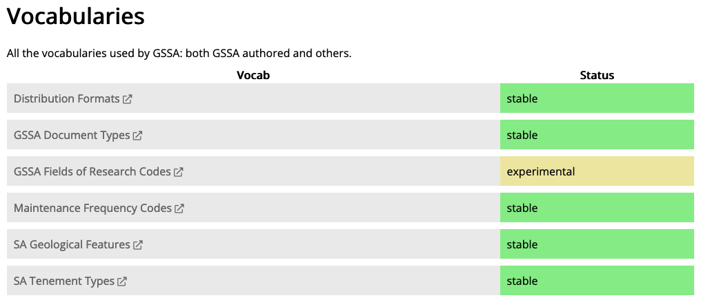
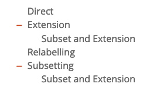
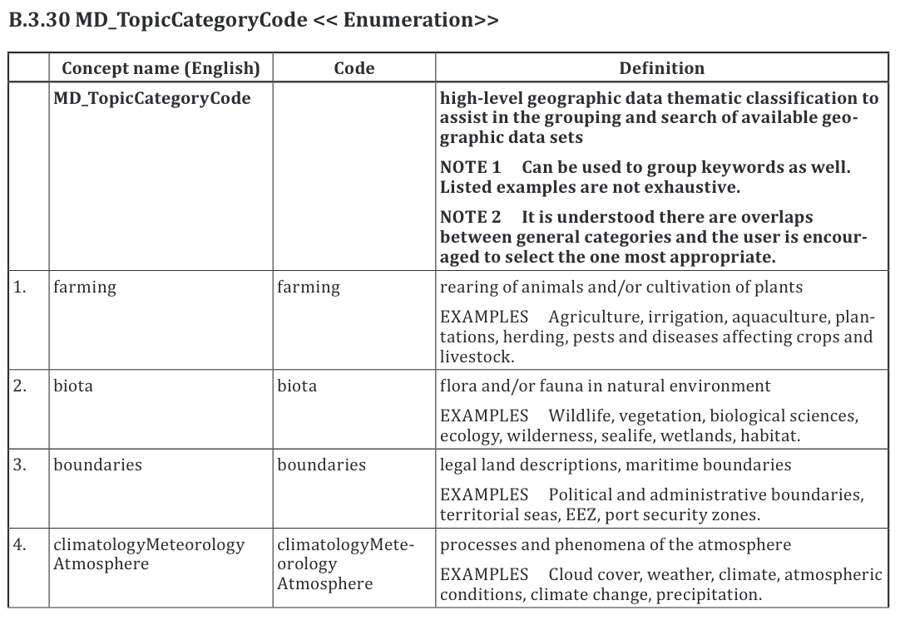

= December 2022 Plenary 

== Agenda

This Agenda will be lead by the GOM convenors with a brief discussion on each point and showing of online resources where indicated.

=== Agenda Outline

. *Welcome*
. *Reminder of the purpose of GOM*
. *Update on GOM standards review process*
. *Demonstration of governance and technical aspects of ISO/TC211 codelists publication*
. *Next Meeting*

=== Agenda Details

. *Welcome*
.. Reminder of https://www.iso.org/publication/PUB100397.html[ISO Code of Conduct]
.. Meeting protocols
.. Roll call
... (re)introduction of co-chairs: Ivana & Nicholas
.. How to contribute/ammend Agenda/Minutes
.. Start Recording
. *Reminder of the purpose of GOM*
.. purpose as it has been to date
.. purpose continuing
. *Update on GOM standards review process*
.. GOM is reviewing the standards using the standards assessment procedure introduced to the ISO/TC211 in May'22 
.. standards reviewed to date: ISO/DTS 19124-1, ISO/CD 19152-1, ISO/CD 19152-3, ISO/CD 19144-2
. *Update on codelists publication*
.. Reminder of codelist publication demonstration as of May, 2022
... VocPub Profile of SKOS https://iso-tc211.github.io/GOM/vocab-profile/[[1]] used as a model to cater for TC needs
.. Further demonstrations of technical approach
... Persistent IRIs
.... Users are desperate for fixity in reference - PID IRIs
.... We have created a PID demo for 2 vocabs
.... ref <<Redirection Examples>>
.... PIDs can easily be implemented for all vocabs, if terget system is assured
.. Vocab model refinements
... Requirements checkoff
.... ref <<Vocab Model Requirements>>
... Vocab Derivation Modes
.... Status per Concept are handled with _Registry Item Status_ as per May Plenary demo
.... _Registry Item Status_ per vocab, ref <<Statuses Example>>
.... GOM vocabs need to indicate derivation status, from original Standard codelist, not registry item status
.... Proposed status vocab: <<Vocabulary Derivation Modes Example>>
... Downstream Derivation modes
.... Users are unsure of how to indicate codelist reuse/derivation
.... This is particularly important for standardised vocabs until/unless effective dynamic registries can be established
.... Some variant of the same Standards Vocab Derivation Modes statuses can be indicated for use
.... ref <<Vocabulary Derivation Modes Example>>
.. Continuing issues
... Handling Enumerations
.... Users want Enumerations as vocabularies too
.... ref <<Enumeration Example>>
.... Do we indicate Enumeration fixedness or allow extension, as per codelists?
.. ISO/TC intentions
... Modeling issues either are or can be addressed
... Technical system issues either are or can be addressed
... What does the ISO/TC want to do?
. *Outcomes of improved Standard Semantic Web assessment procedure*
.. *Outcome #1* - testing of documented procedure https://iso-tc211.github.io/GOM/standards-assessment/[[2]]
.. *Outcome #2* - Automated reporting https://iso-tc211.github.io/GOM/standards-assessment/reports/[[3]]
.. *Outcome #3* - revitalisation of UML -> OWL tooling
... incomplete but proceeding!
.. *Outcome #4* - confirmed specific suggestions for semantic artifact delivery
... Codelist vocabularies http://iso.kurrawong.net/vocab[[4]]
... Ontologies https://github.com/ISO-TC211/GOM/tree/master/isotc211_GOM_harmonizedOntology[[5]]
.. *Proposal:* (from May Plenary) A Bibliography for TC211 in Semantic Web form
. *Proposed Next Steps*
.. Codelists
... Formalise Vocab model Requirements and handling
... Establish and cater for Enumeration requirements in Vocab model
.. Semantic Assessment
... Complete revitalisation of UML -> OWL tooling
... Create/reuse a demo Bibliography for TC211 in Semantic Web form
. *Next Meeting*
.. When
.. Proposed Agenda

[1] https://iso-tc211.github.io/GOM/vocab-profile/

[2] https://iso-tc211.github.io/GOM/standards-assessment/

[3] https://iso-tc211.github.io/GOM/standards-assessment/reports/

[4] http://iso.kurrawong.net/vocab

[5] https://github.com/ISO-TC211/GOM/tree/master/isotc211_GOM_harmonizedOntology

[6] https://github.com/ISO-TC211/GOM/tree/master/standards-assessment/reports

== Vocab Model Requirements

These are Requirements _not_ already catered for by the https://iso-tc211.github.io/GOM/vocab-profile/specification.html[ISO SKOS Vocabulary Profile]:
|===
| ID | Requirement | Model elements

| New 1 | Vocabularies must indicate their status with respect to differences from the original list of Concepts in their defining standard | Use of a derivation status marker at the `ConceptScheme` level
| New 2 | Vocabularies and Concepts must indicate their initial definition, reuse and any altered definitions in Standards' versions | Extended use of `rdfs:isDefinedBy` & versioning properties
| New 3 | Enumerations must be differentiated from Codelists at the vocabulary level | Subclass or status marker for `ConceptScheme`
|===

== Examples

=== Redirection Examples

|===
| Item | PID IRI | Notes

3+| *Role Codes*
| Role Codes codelist | http://def.isotc211.org/iso19115/-1/2018/CitationAndResponsiblePartyInformation/code/CI_RoleCode[http://def.isotc211.org/iso19115/-1/2018/ CitationAndResponsiblePartyInformation/code/CI_RoleCode] | 
| Role Codes _author_ code | http://def.isotc211.org/iso19115/-1/2018/CitationAndResponsiblePartyInformation/code/CI_RoleCode[http://def.isotc211.org/iso19115/-1/2018/ CitationAndResponsiblePartyInformation/code/CI_RoleCode/author] | 
3+| *Item Status*
| Item Status codelist | http://def.isotc211.org/iso19135/-1/2015/CoreModel/code/RE_ItemStatus | 
| Item Status _addition_ code | http://def.isotc211.org/iso19135/-1/2015/CoreModel/code/RE_ItemStatus/addition | 
3+| *Profiles & Formats*
| Role Codes _author_ via profile, default | http://iso.kurrawong.net/vocab/CI_RoleCode/author?_profile=vocpub&_mediatype=application/rdf+xml[http://def.isotc211.org/iso19115/-1/2018/ CitationAndResponsiblePartyInformation/code/CI_RoleCode/author?_profile=vocpub] | any and multiple profiles can be implemented, if we have the data
| Role Codes _author_ Alternate profiles listing  | http://iso.kurrawong.net/vocab/CI_RoleCode/author?_profile=alt[http://def.isotc211.org/iso19115/-1/2018/ CitationAndResponsiblePartyInformation/code/CI_RoleCode/author?_profile=alt] | any and multiple profiles can be implemented, if we have the data
| A05 vocabulary profiles | http://vocab.nerc.ac.uk/collection/A05/current/?_profile=alt | Note the non-RDF profiles, e.g. http://vocab.nerc.ac.uk/collection/A05/current/?_profile=dd&_mediatype=application/json[dd]
| Role Codes _author_ via profile & format  | http://iso.kurrawong.net/vocab/CI_RoleCode/author?_profile=vocpub&_mediatype=application/ld+json[http://def.isotc211.org/iso19115/-1/2018/ CitationAndResponsiblePartyInformation/code/CI_RoleCode/author?_profile=vocpub&_mediatype=application/ld+json] | 
|===

=== Statuses Example

.Vocabularies from the Geological Survey of South Australia showing per-vocab status https://gssa-prez-linux-web-app.azurewebsites.net/vocab/[GSSA Vocabs]

* Here the status of vocabularies within a register using https://linked.data.gov.au/def/reg-statuses[an extension] of http://def.isotc211.org/iso19135/-1/2015/CoreModel/code/RE_ItemStatus [ISO19135 _Item Status_ codes] are shown.
* GOM Semantic Web vocabularies need to indicate derivation status, not registered item status

=== Vocabulary Derivation Modes Example

From https://gssa-prez-linux-web-app.azurewebsites.net/vocab/vocab-derivation-modes[GSSA's Vocabulary Derivation Modes vocabulary]:

.The current modes listed in the https://gssa-prez-linux-web-app.azurewebsites.net/vocab/vocab-derivation-modes[Vocab Derivation Modes] vocabulary

=== Enumeration Example

.Part of an Enumeration from ISO19115, re-implemented as a SKOS vocab at https://gssa-prez-linux-web-app.azurewebsites.net/vocab/topic-categories[GSSA Topic Categories]

