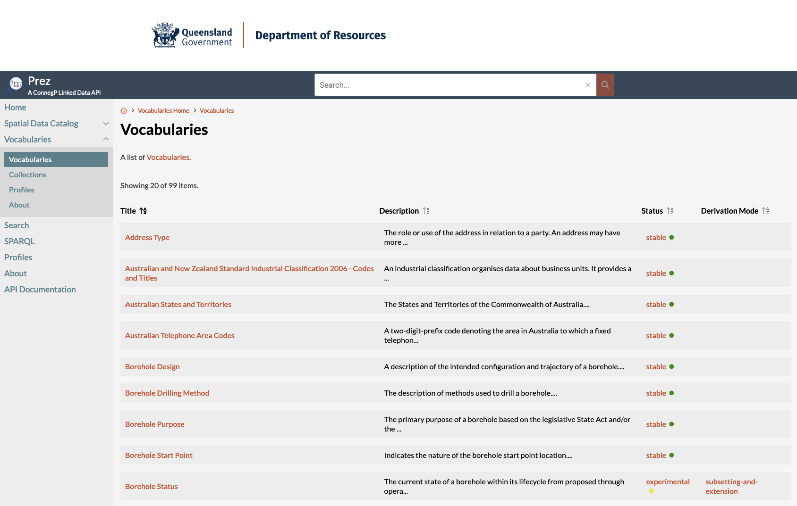
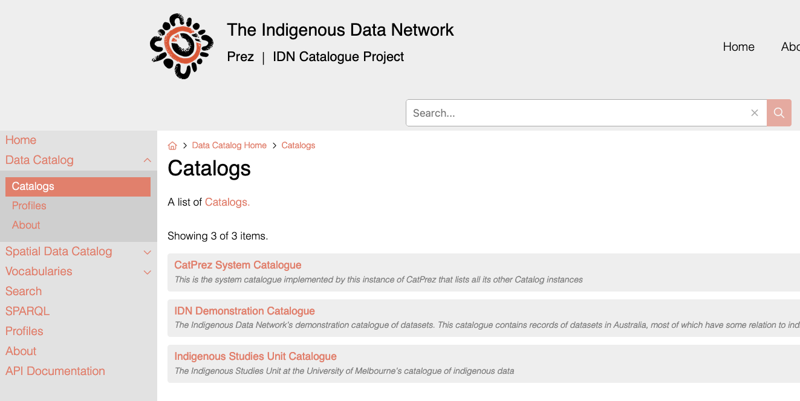
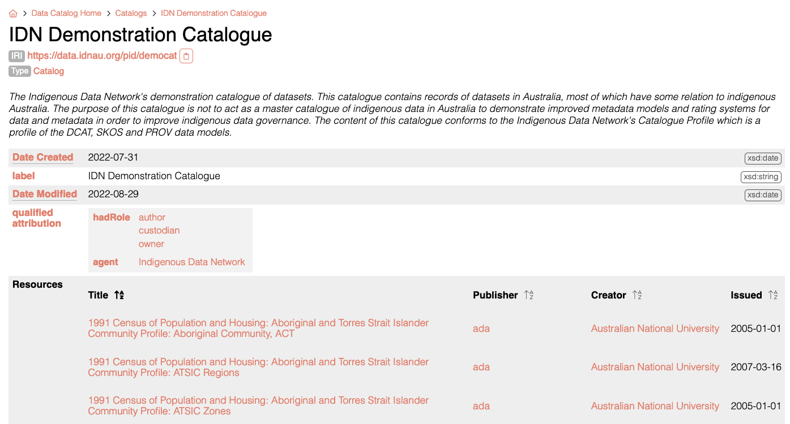
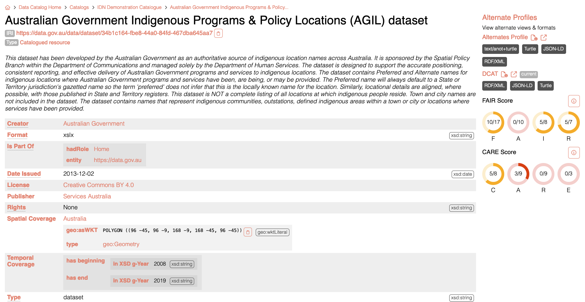
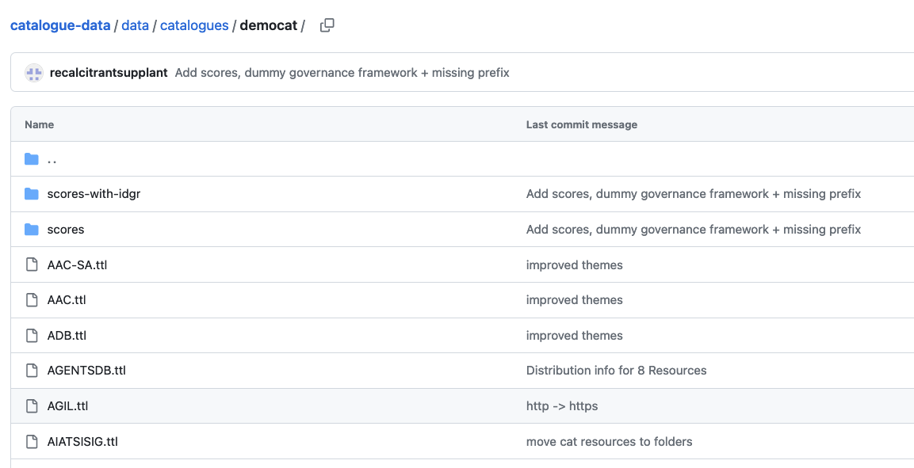
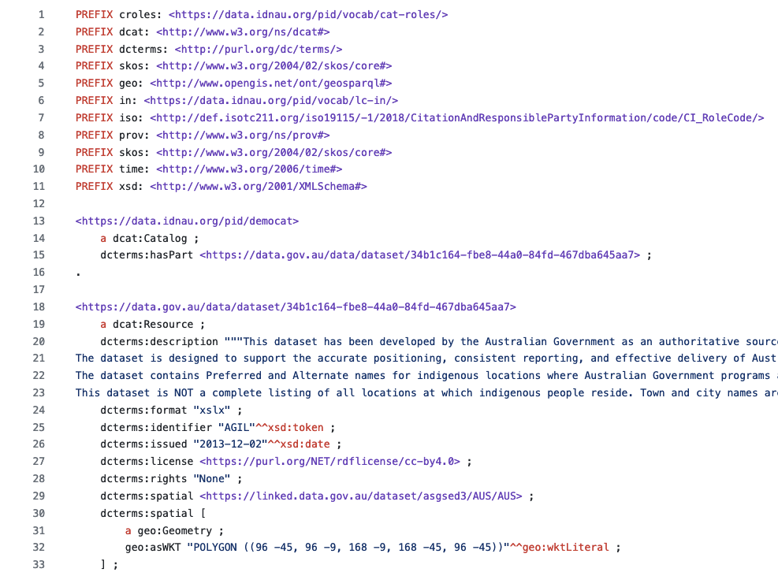
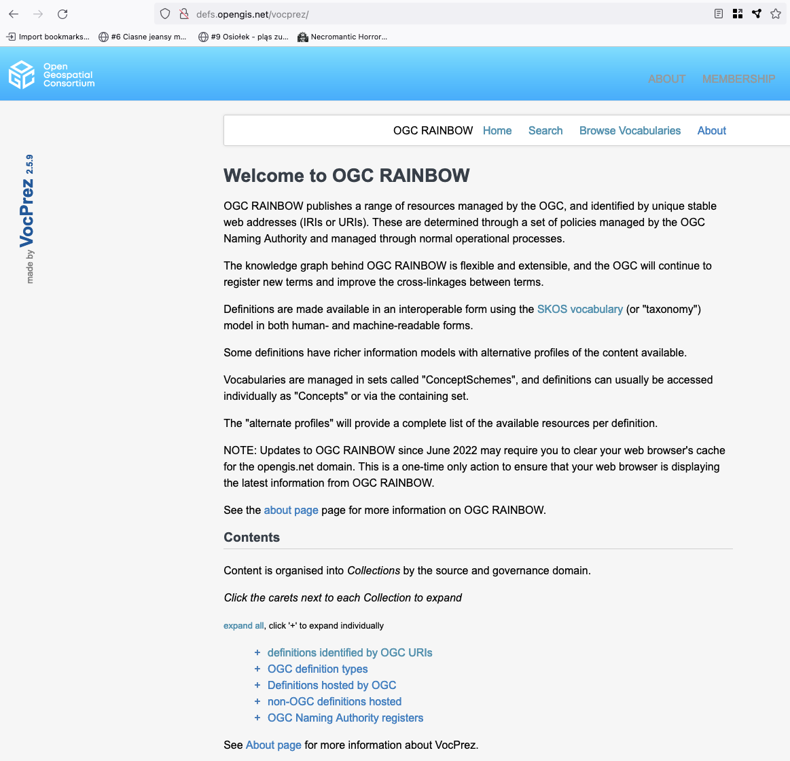

= December 2023 Plenary 

== Agenda

This Agenda will be lead by the GOM convenors with a brief discussion on each point and showing of online resources where indicated.

=== Agenda Outline

. *Welcome*
. *Reminder of the purpose of GOM*
. *Update on GOM standards review process*
. *ISO/TC211 Harmonized Resources Registry*
. *Discussion*
. *Next Meeting*

=== Agenda Details

. *Welcome*
.. Reminder of https://www.iso.org/publication/PUB100397.html[ISO Code of Conduct]
.. Meeting protocols
.. Roll call
... (re)introduction of co-chairs: Ivana & Nicholas
.. How to contribute/amend Agenda/Minutes
.. Start Recording
. *Reminder of the purpose of GOM*
.. purpose as it has been to date
.. purpose continuing
. *Update on GOM standards review process*
.. GOM is reviewing the standards using the standards assessment procedure introduced to the ISO/TC211 in December'22 
.. standards reviewed since the last meeting: ISO 19144-3
. *Cost of establishing and maintaining ISO/TC211 Harmonized Resources' Registry*
+
--
Based on the experience of operating registries for organisations similar requirements to TC211, in particular the http://defs.opengis.net/vocprez/[Open Geospatial Consortium's Naming Authority] and the https://cgi.vocabs.ga.gov.au/[Commission for Geoscience Information], we can estimate the following tasks and _rough order of magnitude_ costs for TC211 to run a registry if using similar tools. 

The tool considered for use is https://prez.dev[Prez], an open-source product developed for vocabulary and catalogue information delivery. It is partly mantained by the OGC for use in its 'Rainbow' - the OGC's reference catalogues and machine-readable data. Prez was used to demonstrate a codelists vocabulary register in AG6 (GOM) sessions during ISO/TC211 Plenary in Dec '22 and May'23. It is currently used widely and it is free. Examples of operational use are:

* https://data-uat.bgs.ac.uk/[British Geological Survey's Linked Data assets]
* https://cgi.vocabs.ga.gov.au/vocab/[Commission for Geoscience Information's vocabularies]
* http://defs.opengis.net/vocprez/[OGC's 'Rainbow']
* https://data.idnau.org/[Aust. Indigenous Data Network's multi-catalogue]

An ISO/TC211 Registry could support multiple registers, e.g. for HM, OWL, XML content, and a specialised "vocabs" register for codelist vocabularies.

The costs below are entirely labour and cloud computing costs with labour being by far the greatest component. Labour is priced at CHF900 per day - the NGO rate of https://kurrawong.ai[KurrawongAI] who supports Prez.

The following is a task and cost breakdown.

[width=75%, cols="1,3,1,1"]
|===
| Task  | Description | Effort | Cost

| Establish a Registry system | Create an instance of the Registry software in a public cloud | 1 week | CHF4500
| Customise the Registry | Implement TC211s particular Registers (models, codelists etc) with customised item properties | 2 weeks | CHF9000
| Establish workflows | Create version control system workflows to maintain the state of data in the Registry | 2 weeks | CHF9000
| Train users | Online live training sessions and support for TC211 staff/volunteers to learn to use the system | 1 week equivalent | CHF4500
|===

After the tasks above, TC211 could continue to use the Registry system in the public cloud it established within as a managed service or it could "in-house" the system onto its own cloud or on-prem IT infrastructure:

[width=75%, cols="1,3,1,2"]
|===
| Task  | Description | Effort | Cost

| Operate Register as managed service | Cloud operating costs (perhaps CFH1000 p.a.) + CFH900 to CFH450 per month | ongoing | CHF10800 1st year, expected to reduce to CHF5400
| Hand over system | Work with ISO/TC211 IT support to bring system in-house | 2 weeks effort, elapsed over the timeframe needed | CHF9000 (one-time)
|===

Thus, a total system establishment, customisation, training and one year managed service operation cost could be:

* CHF4500 + CHF9000 + CHF9000 + CHF4500 + CHF10800 = *CHF37,800*
--
. *Discussion*
.. Which resources will ISO/TC Harmonized Maintenance Agency curate?
... HM from https://github.com/ISO-TC211/HMMG
... XML from https://github.com/ISO-TC211/XMG
... OWL from https://github.com/ISO-TC211/GOM
... codelists
... links to registers together and where are they used:
+
[width=50%, cols="1,2"]
|===
| Registry  | Used by

| ISO 19127: https://geodetic.isotc211.org/ | UN-GGIM GGCE, ...  
| ISO 19157-3 https://dqm.isotc211.org  | EVERYBODY, ... 
| ... | ...
|===
+
. *Next Meeting*
.. When
.. Proposed Agenda

=== Annex: Proposed System screenshots

.VocPrez listing of vocabularies

.CatPrez listing of catalogues

.CatPrez resources in a catalogue

.A CatPrez Resource showing FAIR scores

.CatPrez resources data in GitHub

.Source data for the AGIL Resource shown above

.OGC VocPrez, soon to be *Prez
