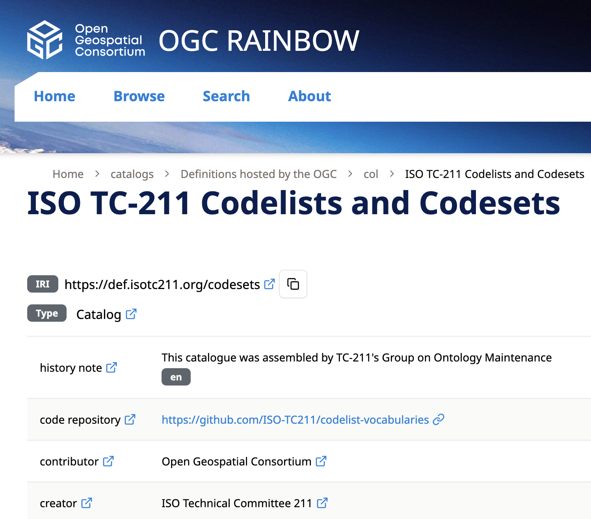
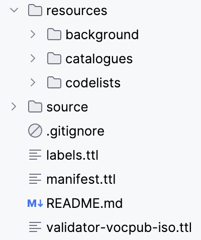
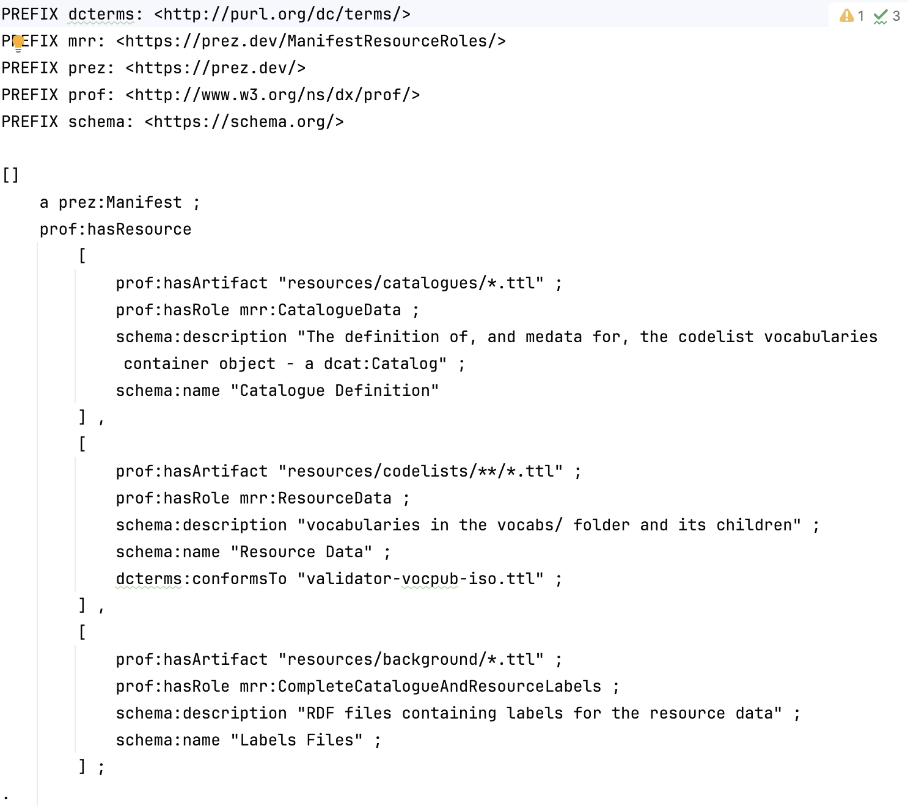
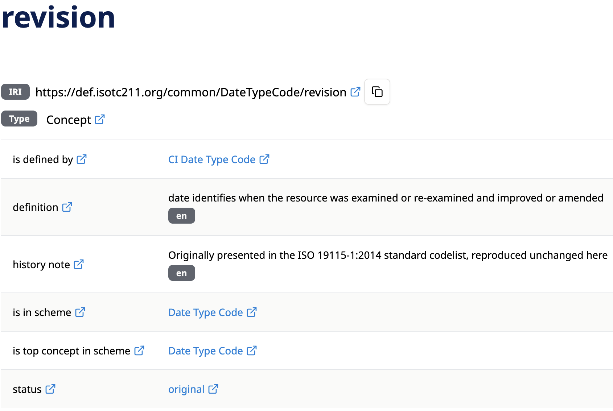
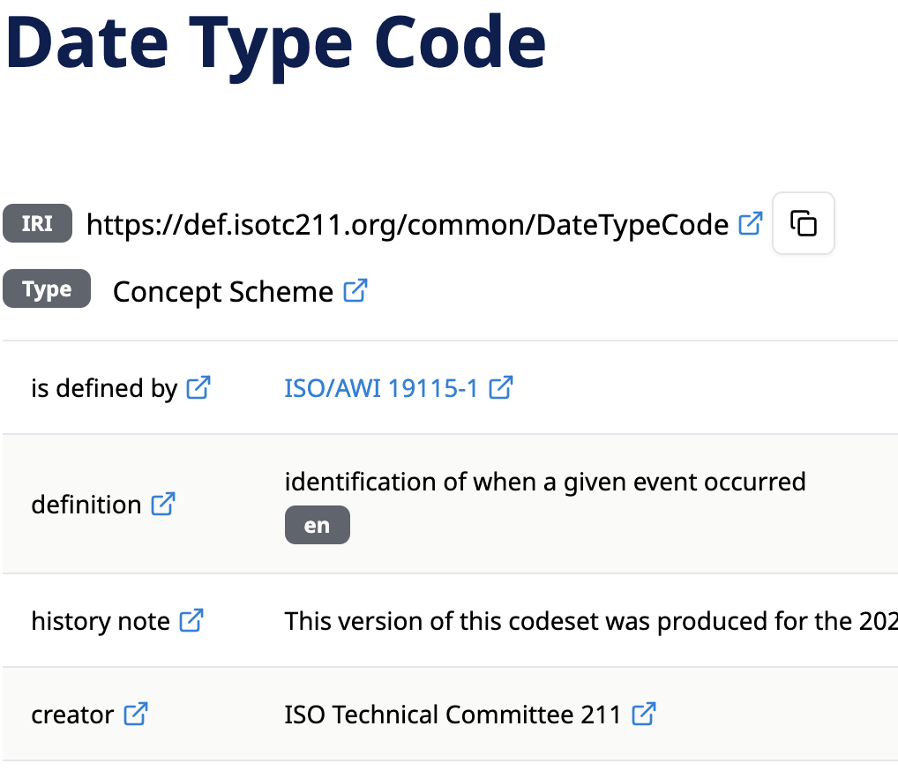
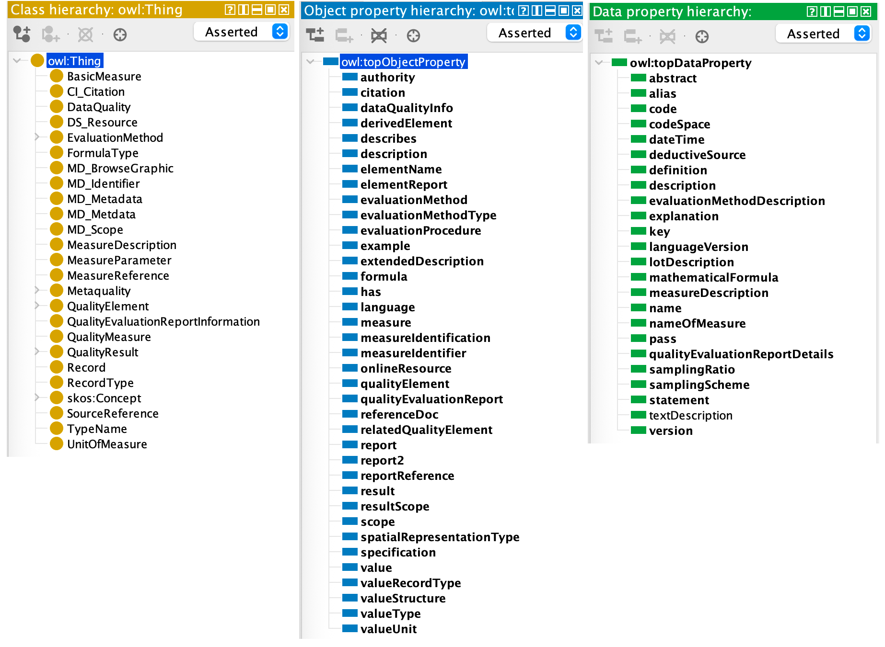
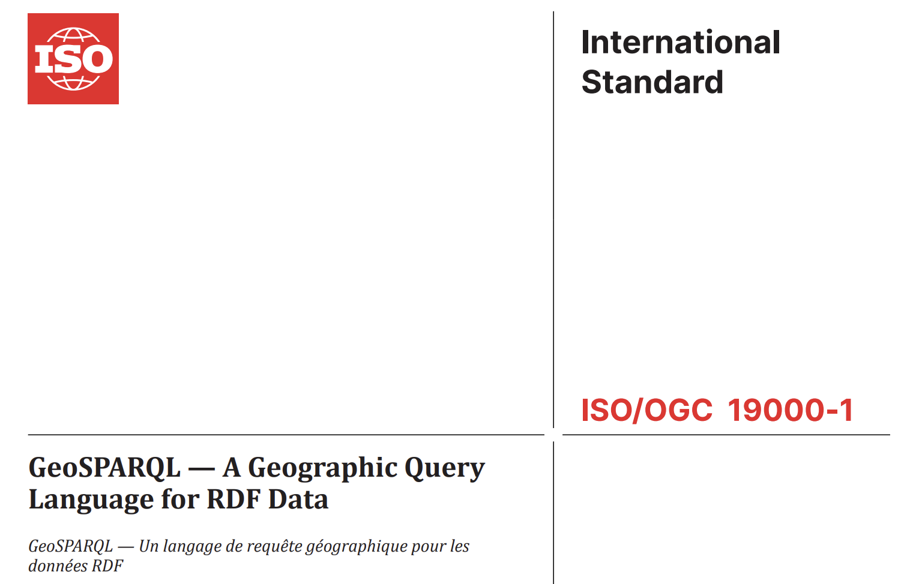

= November 2025 Plenary 

== Agenda

This Agenda will be lead by the GOM convenors with a brief discussion on each point and showing of online resources where indicated.

It is online at https://github.com/ISO-TC211/GOM/blob/master/meetings/plenary-2025-11-19.adoc

=== Agenda Outline

. *Welcome*
. *Standards' Semantic Web reviews report*
. *Codelist vocabularies report*
. *Ontology production proposal*
. *Proposed GeoSPARQL standard review*
. *Discussion*
. *Next Meeting*

=== Agenda Details

==== 1. Welcome

. Reminder of https://www.iso.org/publication/PUB100397.html[ISO Code of Conduct]
. Meeting protocols
. Roll call
.. (re)introduction of co-chairs: Ivana & Nicholas
. How to contribute/amend Agenda/Minutes
. Start Recording

==== 2. Standards' Semantic Web reviews report

. No new standards assessed since last plenary
. Coming up: GeosPARQL - see below
. Re-review of 19157-* in progress

GOM can now make further recommendations for semantic registers since:

. the codelist vocabs are live
. the Rainbow can delivery arbitrary semantic content
** not restricted to SKOS
. ontologies may be live soon
** see *4.* below

===== Re-review of 19157-*

19157 re-review is motivated by 19157-3's register of complex objects preset on the Rainbow - https://defs-hosted.opengis.net/prez-hosted/catalogs/hosted:iso-19157-3/collections/ns10:qualityMeasure[ISO19157-3 quality measures] - and Ivana's involvement.

*RECOMMENDATION*: Extend the skill of existing codelists to remove need for custom information. Here, use a new _Collection_ within https://def.isotc211.org/RE/ItemStatus[Registered Item Status Codes] to contain 19157-3 allowed statuses, rather than custom statuses

*RECOMMENDATION*: Turn more register values into codelists, https://def.isotc211.org/common/EvaluationMethodTypeCode[_Evaluation method type_], https://def.isotc211.org/common/ValueStructure[_Value structure_] & https://def.isotc211.org/common/FormulaLanguage[_Formula language_] - all done

*RECOMMENDATION*: Reconsider the SKOS+ nature of the Register

* in discussion
* see SKOS+ reference below
* will need to work with Register-involved maintenance AGs

===== Next Steps

. Formulate a new set of review points
** since we have new possibilities and as prototyped for 19157.
. Produce a new review report for 19157-*
. Re-reun new review for ??

==== 3. Codelist vocabularies report

===== Progress to date

* ~50 codelists are now publish in production on the OGC's Rainbow at https://defs.opengis.net/prez/catalogs/ogc-cat:hosted/col/defisotc211org:codesets
* PIDs have been allocated using `def.isotc211.org`, e.g. https://def.isotc211.org/common/DateTypeCode
** PID redirection mechanism needs improvement
* technical content management procedures almost complete
** sync from managed repo to Rainbow ready for complete automation - little OGC effort
** validation & annotation built in
** follow vocab procedures elsewhere

Manifest-based content management:

* all new 19115 codelists and some older codelists have been published in the `/common/` register
* legacy registers of `/CI/`, `/DS/`, `/MD/`, `/RE/` & `/SV/` retained for now
** detailed codelist versioning is implemented to handle legacy & new
** e.g. `isDefinedBy` for terms' defining vocab v. `inScheme` for reuse
** we propose to deprecate legacy registers

[#imgRevisionCode,link="files/2025-11-19/revision-code.png"]

* codelists/sets are linked to their defining standards via a https://defs.opengis.net/prez/object?iri=https://def.isotc211.org/common/standard[supplementary vocab of standards]
** this is the only non-codelist/set vocab so far implemented
* Extended https://def.isotc211.org/RE/ItemStatus[Register Item Status Codes] allow for the indicateion of `original` & `addition` variants of `stable`
** to show stable terms as being from the standard `original` or additions

[#imgRevisionCode,link="files/2025-11-19/date-type-code-ifdefinedby.png"]

See https://def.isotc211.org/common/DateTypeCode[Date Type Code]

* several vocabs - from 19137 - are SKOS+ vocabs, indicating OWL classing
** e.g. https://defs.opengis.net/prez/object?uri=https://def.isotc211.org/common/ValueStructure/bag[ValueStructure]

Initial production publication is now complete.

===== Next steps

1. implement a better PID redirection mecahnism for `def.isotc211.org`
2. completion of publication all 19* codelists
** investigate technical delivery options - Genericode, XML etc.
3. outreach to codelist users
** encourage users to move to official versions and provide feedback
** gauge appetite for extended ontology and alternate forms
4. how to use help
** documentation - on patterns used for versioning, statuses, codelist extension
** training - within TC & beyond. Engagement with WGs and individuals to best use the vocabs
5. exercise governance
** probably for 19115 codesets
6. demo of vocabs within ontology context - next item
7. demo of further SKOS+ vocabs
** to demo creeping semantics
** inc. https://defs-hosted.opengis.net/prez-hosted/catalogs/hosted:iso-19157-3/collections/ns10:qualityMeasure[19157 already test published on the Rainbow 'Hosted']

==== 4. Ontology production proposal - redux

* we propose a renewed attempt to create ontologies for all 19* data models
** that have been brought into the Harmonised Model
** we will aim for good documentation as well as machine-readable ontologies
*** publication via the OGC Rainbow too - capability arriving soon
** we have tested hand-generation of 19157-1
** will aim for automation from HM, after testing manual creations
*** will implement UML as per the HM in documentation

It is feasable to implement _all_ 19* models by next plenary, now that publication infrastructuer is in place - from codelists.

===== Lessons from renewed ont. generation

[#img19157ont,link="files/2025-11-19/19157-ont.png"]

From a test generation of 19157-1 ontology, we believe we are mostly still in line with issues raised on previous ontology generation process in 2023:

* issues relating to embedded codelists no longer exist
* we need to be able to vary the ontology from the UML to meet ontology Good Practice
** e.g. property reuse, viz in 19157-1: `report` & `report` with different constraints; `name` & `nameOfMeasure` and `description` & `evaluationMethodDescription`
** changes will be very minor
* we need better IRIs
** like implemented for codelists
** still using `def.isotc211.org`

We will demo all these things for 19157-1 before next plenary

===== Next Steps

* Finalise 19157-1 model -> ontology extraction
* (test) publish the ontology
** as HTML, with images
** with a log of changes from UML -> OWL
* enhance the 19157-3 QM Register using new ontology content

==== 5. Proposed GeoSPARQL standard review

OGC's GeoSPARQL is proposed for co-adoption by TC-211 via _fast track_.

Known tasks:

* GOM wants to re-run the updated evaluation process as developed above
* terminology must be harmonised into TMG

Some implications are not yet clear:

* is the GeoSPARQL ontology 'part of' a future 19* series, based on HM?
* what does ongoing governance look like?
** an OGC ongoing body has been determined: Geosemantics DWG
** does the TC accept governance of technical assets without involvement?

==== 6. Discussion

==== 7. Next Meeting

May Plenary?

Nick will not be able to attend in person.
