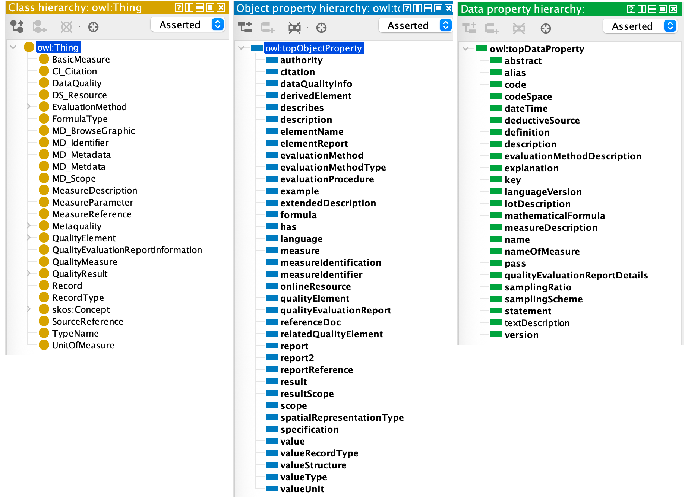
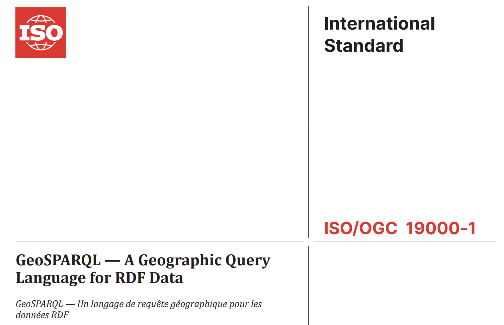

= AG6 Group on Ontology Maintenance - May 2026 Plenary

== DRAFT Agenda

This Agenda will be lead by the GOM convenors with a brief discussion on each point and showing of online resources where indicated.

It is online at https://github.com/ISO-TC211/GOM/blob/master/meetings/plenary-2026-05-06.adoc

=== Agenda Outline

. *Welcome*
. *Standards' Semantic Web reviews report*
. *Code sets publication report*
. *Code sets Interim Governance plan*
. *Ontology production proposal*
. *Proposed GeoSPARQL standard review*
. *Discussion*
. *Next Meeting*

=== Agenda Details

==== 1. Welcome

. Reminder of https://www.iso.org/publication/PUB100397.html[ISO Code of Conduct]
. Meeting protocols
. Roll call
.. (re)introduction of co-chairs: Ivana & Nicholas
. How to contribute/amend Agenda/Minutes
. Start Recording

==== 2. Standards' Semantic Web reviews report

. New standards assessed since last plenary: ISO/DTR 19115-4, ISO/FDIS 19127, ISO/FDIS 19157-3, ISO/DIS 19163-2, ISO/DTS 124-4, ISO/DTS 19123-4, ISO/DIS 19186-1, ISO/DIS 19161-2
. Standards assessment procedures are being reviewed in light of expected ontology production and existing code set publication
** new, experimental procedures to be presented at next plenary

===== Re-review of 19157-*

_These points were presented the same in Dec 2025 but will be revisited briefly here, unchanged, for discussion_

19157-* ontology in progress

19157 re-review is motivated by 19157-3's register of complex objects preset on the Rainbow - https://defs-hosted.opengis.net/prez-hosted/catalogs/hosted:iso-19157-3/collections/ns10:qualityMeasure[ISO19157-3 quality measures] - and Ivana's involvement.

*RECOMMENDATION*: Extend the skill of existing codelists to remove need for custom information. Here, use a new _Collection_ within https://def.isotc211.org/RE/ItemStatus[Registered Item Status Codes] to contain 19157-3 allowed statuses, rather than custom statuses

*RECOMMENDATION*: Turn more register values into codelists, https://def.isotc211.org/common/EvaluationMethodTypeCode[_Evaluation method type_], https://def.isotc211.org/common/ValueStructure[_Value structure_] & https://def.isotc211.org/common/FormulaLanguage[_Formula language_] - all done

*RECOMMENDATION*: Reconsider the SKOS+ nature of the Register

* in discussion
* see SKOS+ reference below
* will need to work with Register-involved maintenance AGs

==== 3. Code sets vocabularies report + CIB result

===== Progress to date

image::files/2025-11-19/rainbow-codelists.png[width="50%"]

* ~50 codelists are now publish in production on the OGC's Rainbow at https://defs.opengis.net/prez/catalogs/ogc-cat:hosted/col/defisotc211org:codesets
* PIDs have been allocated using `def.isotc211.org`
** note we are using `/codeset/` as the type register for Code Sets, not the originally proposed `/common/` which has less obvious meaning, e.g. https://def.isotc211.org/codeset/DateTypeCode
** PID redirection mechanism improved since December
*** as needed
*** a full proxy server is in place for `def.isotc211.org`
** legacy registers (`/CI/`, `/DS/` etc.) deprecated
* technical content management procedures almost complete
** sync from managed repo to Defs Server still in place as per Dec but OGC not yet automated

Initial _technical_ production publication is now complete: we are awaiting on-going governance arrangements.

===== CIB result

??

===== Next steps

1. Implement interim governance procedures
** see Section 4. below.
2. how to use help*
** documentation - on patterns used for versioning, statuses, codelist extension
** training - within TC & beyond. Engagement with WGs and individuals to best use the vocabs
3. demo of vocabs within ontology context - next item*
4. demo of further SKOS+ vocabs*
** to demo creeping semantics

&nbsp;* items carried over from December 2025 Plenary

==== 4. Code sets Interim Governance plan

GOM will undertake management of Code Sets as per ISO 19135 by:

* acting as _Register Manager_ for ISO/TC 211 (_Register Owner_)
* acting as _Registry Manager_
* acting as interim _Control Body_
** until a suitable _Control Body_ can be found for each Code Set
** preferably naming no changes as interim
* attempting to find/create _Control Bodies_ per standard or other Code Set grouping
** stating with Code Sets already produced and WGs in progress
* working with HMMG & RMG

General 19135 roles:

[#img19135,link="files/2026-05-05/19135.png"]
image::files/2026-05-05/19135.png[width="90%"]

Proposal for 19115 code sets:

[#img19135,link="files/2026-05-05/19135-19115.png"]
image::files/2026-05-05/19135-19115.png[width="90%"]

Proposal for 19160 code sets:

[#img19135,link="files/2026-05-05/19135-19160.png"]
image::files/2026-05-05/19135-19160.png[width="90%"]

==== 5. Ontology production proposal - redux

* we propose a renewed attempt to create ontologies for all 19* data models
** that have been brought into the Harmonised Model
** we will aim for good documentation as well as machine-readable ontologies
*** publication via the OGC Rainbow too - capability arriving soon
** we have tested hand-generation of 19157-1
** will aim for automation from HM, after testing manual creations
*** will implement UML as per the HM in documentation

It is feasable to implement _all_ 19* models by next plenary, now that publication infrastructuer is in place - from codelists.

* several vocabs - from 19137 - are SKOS+ vocabs, indicating OWL classing
** e.g. https://defs.opengis.net/prez/object?uri=https://def.isotc211.org/codeset/ValueStructure/bag[ValueStructure]

===== Lessons from renewed ont. generation

[#img19157ont,link="files/2025-11-19/19157-ont.png"]

From a test generation of 19157-1 ontology, we believe we are mostly still in line with issues raised on previous ontology generation process in 2023:

* issues relating to embedded codelists no longer exist
* we need to be able to vary the ontology from the UML to meet ontology Good Practice
** e.g. property reuse, viz in 19157-1: `report` & `report` with different constraints; `name` & `nameOfMeasure` and `description` & `evaluationMethodDescription`
** changes will be very minor
* we need better IRIs
** like implemented for codelists
** still using `def.isotc211.org`

We will demo all these things for 19157-1 before next plenary

===== Next Steps

* Finalise 19157-1 model -> ontology extraction
* (test) publish the ontology
** as HTML, with images
** with a log of changes from UML -> OWL
* enhance the 19157-3 QM Register using new ontology content

==== 6. Proposed GeoSPARQL standard review

OGC's GeoSPARQL is proposed for co-adoption by TC-211 via _fast track_.

Known tasks:

* GOM wants to re-run the updated evaluation process as developed above
* terminology must be harmonised into TMG

Some implications are not yet clear:

* is the GeoSPARQL ontology 'part of' a future 19* series, based on HM?
* what does ongoing governance look like?
** an OGC ongoing body has been determined: Geosemantics DWG
** does the TC accept governance of technical assets without involvement?

==== 7. Discussion

==== 8. Next Meeting

December Plenary
