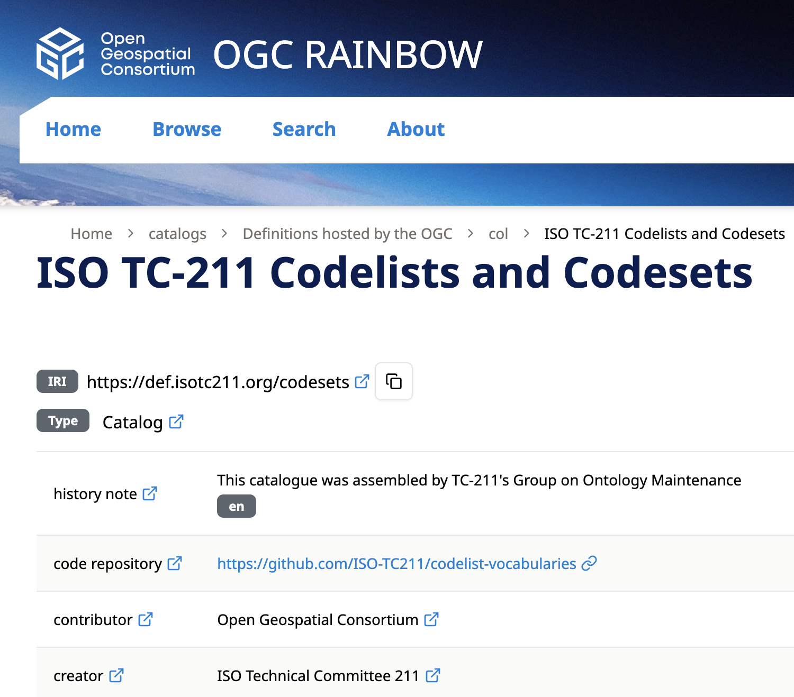
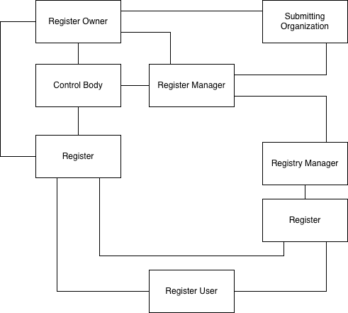
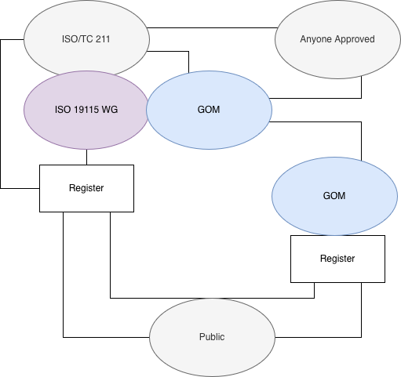
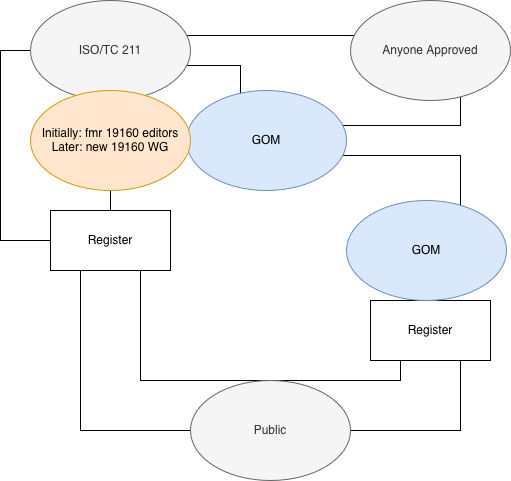

= AG6 Group on Ontology Maintenance - May 2026 Plenary

== Agenda

This Agenda will be lead by the GOM convenors with a brief discussion on each point and showing of online resources where indicated.

It is online at https://github.com/ISO-TC211/GOM/blob/master/meetings/plenary-2026-05-06.adoc

=== Outline

. *Welcome*
. *Standards' Semantic Web reviews report*
. *Code sets publication report*
. *Code sets Interim Governance plan*
. *Ontology production progress*
. *GeoSPARQL standard review*
. *Discussion*
. *Next Meeting*

=== Details

==== 1. Welcome

. Reminder of https://www.iso.org/publication/PUB100397.html[ISO Code of Conduct]
. Meeting protocols
. Roll call
.. (re)introduction of co-chairs: Ivana & Nicholas
. How to contribute/amend Agenda/Minutes
. Start Recording

==== 2. Standards' Semantic Web reviews report

. New standards assessed since last plenary: ISO/DTR 19115-4, ISO/FDIS 19127, ISO/FDIS 19157-3, ISO/DIS 19163-2, ISO/DTS 124-4, ISO/DTS 19123-4, ISO/DIS 19186-1, ISO/DIS 19161-2
. Standards assessment procedures are being reviewed in light of expected ontology production and existing code set publication
** new, experimental procedures to be presented at next plenary

===== Re-review of 19157-*

_These points were presented the same in Nov 2025 but will be revisited briefly here, unchanged, for discussion_

19157-* ontology in progress

19157 re-review is motivated by 19157-3's register of complex objects presnted on the Rainbow - https://defs-hosted.opengis.net/prez-hosted/catalogs/hosted:iso-19157-3/collections/ns10:qualityMeasure[ISO19157-3 quality measures] - and Ivana's involvement.

*RECOMMENDATION*: Extend the skill of existing codelists to remove need for custom information. Here, use a new _Collection_ within https://def.isotc211.org/RE/ItemStatus[Registered Item Status Codes] to contain 19157-3 allowed statuses, rather than custom statuses

*RECOMMENDATION*: Turn more register values into codelists, https://def.isotc211.org/common/EvaluationMethodTypeCode[_Evaluation method type_], https://def.isotc211.org/common/ValueStructure[_Value structure_] & https://def.isotc211.org/common/FormulaLanguage[_Formula language_] - all done

*RECOMMENDATION*: Reconsider the SKOS+ nature of the Register

* in discussion
* see SKOS+ reference below
* will need to work with Register-involved maintenance AGs

==== 3. Code sets vocabularies report + CIB result

===== Progress to date

* ~50 codelists are now publish in production on the OGC RAINBOW at https://defs.opengis.net/prez/catalogs/ogc-cat:hosted/col/defisotc211org:codesets
* PIDs have been allocated using `def.isotc211.org`
** note we are using `/codeset/` as the type register for Code Sets, not the originally proposed `/common/` which has less obvious meaning, e.g. https://def.isotc211.org/codeset/DateTypeCode
** PID redirection mechanism improved since NOvember
*** as needed
*** a full proxy server is in place for `def.isotc211.org`
** legacy registers (`/CI/`, `/DS/` etc.) deprecated
* technical content management procedures almost complete
** sync from managed repo to Defs Server still in place as per Nov but OGC not yet automated

Initial _technical_ production publication is now complete: we are awaiting on-going governance arrangements.

===== CIB result

??

===== Next steps

1. Implement interim governance procedures
** see Section 4. below.
2. how to use help*
** documentation - on patterns used for versioning, statuses, codelist extension
** training - within TC & beyond. Engagement with WGs and individuals to best use the vocabs
3. demo of vocabs within ontology context - next item*
4. demo of further SKOS+ vocabs*
** to demo creeping semantics

&nbsp;* items carried over from November 2025 Plenary

==== 4. Code sets Interim Governance plan

GOM will undertake management of Code Sets as per ISO 19135 by:

* acting as _Register Manager_ for ISO/TC 211 (_Register Owner_)
* acting as _Registry Manager_
* acting as interim _Control Body_
** until a suitable _Control Body_ can be found for each Code Set
** preferably naming no changes as interim
* attempting to find/create _Control Bodies_ per standard or other Code Set grouping
** stating with Code Sets already produced and WGs in progress
* working with HMMG & RMG

General 19135 roles:

[#img19135,link="files/2026-05-05/19135.png"]

Proposal for 19115 code sets:

[#img19135,link="files/2026-05-05/19135-19115.png"]

Proposal for 19160 code sets:

[#img19135,link="files/2026-05-05/19135-19160.png"]

===== Timeline

[cols="1,3", width="65%"]
|===
| Apr -> Jun | 19115 & 19160 Control Body determination +
plus any volunteers
| Jun -> Sep | Harmonised governance discussion with HMMG, RMG
| Oct -> Nov | Governance testing
| Nov | Plenary presentation
|===

==== 5. Ontology production progress

===== Status

* production of a "Harmonised Ontology" has started
** as proposed in Nov 2025 Plenary
** picking up and extending on 2020 work by Jean Brodeur

===== What's different now

* build on the Harmonised Model
* not touching code sets
* proposing several "styles" of ontology patterning for delivery
** see styles table below
* work being conducted by a team
** higher quality output
** Team Lead: Nicholas Car
** Consultants:
*** TC211: Ivana Ivanova (RMG), Kut Jetland (HM)
*** Ontology: Profs Tim French (U Western Australia)
*** ISO/Ont: Prof Melinda Hodkiewicz (ISO/TC 251)
*** Spatial: Prof Matt Duckham (RMIT)
** Students
*** Adib Rohani - ontology production assistance & verification
*** Mirabdulla Mirsodikov - spatial domain value proposition testing

.Ontology Styles
[cols="35%,75%"]
|===
| Name | Description

| 1:1 | UML -> OWL, no alterations. As per 2020
| Predicate deduplication only | Keep classes as-is, deduplicate `name`, `className`, `nameOfMeature` etc
| Generic ontology reuse | reuse well-regarded non-ISO ontologies for non-spatial elements only, +
e.g. W3C PROV for provenance, perhaps schema.org
| Maximal ontology reuse | Use well-regarded ontologies (from W3C, OGC?, others?) as much as possible
|===

===== Timeline

* things resolved since last plenary:
** IRI patterns resolved & redirection mechanism in place
** Defs Server is ontology HTML capable
** verification methods determined: OWL reasoning & SHACL

[cols="1,3", width="65%"]
|===
| Pre Apr | 19157 Ont test case
| Apr -> Jun | Initial ontology production
| Apr -> Jun | Expected spatial value
| Jun -> Sep | Ontology style consultation
| Jun -> Sep | Spatial value assessment publication
| Oct -> Nov | Ontology testing
| Nov | Plenary presentation
| Dec+ | Governance arrangements +
building on Code Sets
|===

===== Next Steps

* revitalisation of the HM ontology production script
* comparison of script v. other extraction code
* script output comparison
** v. 19137 hand-made ontology
** v. 19186 (GeoSPARQL!)
** 19108 v Time Ontology in OWL

==== 6. GeoSPARQL standard review

http://www.opengis.net/doc/IS/geosparql/1.1[OCG GeoPSARQL 1.1] is now DIS 19186.

Q's about GeoSPARQL from previous Plenary:

* is the GeoSPARQL ontology 'part of' a future 19* series, based on HM?
** Yes
* what does ongoing governance look like?
** As per Code sets

Open Qs:

* does the TC accept governance of technical assets without involvement?
** so far, yes, but perhaps not for Harmonised Ontology onwards

and related to above, in general:

* What does a future OGC & ISO GeoSPARQL look like
** when some GeoSPARQL mappings/dependencies have TC ontologies
*** esp. OWL Time (v. 19108)

==== 7. Discussion

==== 8. Next Meeting

Nov/Dec Plenary
