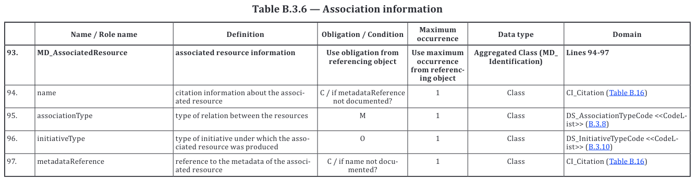

= Codelist Vocabularies

This directory of GOM's code repository contains https://www.w3.org/standards/semanticweb/[Semantic Web] versions of codelists found in ISO's https://www.iso.org/committee/54904.html[TC-211's] 19* series of geographic information/geomantic standards.

== Purpose

Many non-ISO-sponsored versions of TC211's codelists have been available on the Internet over the past two decades due to a community wish for certain machine-readable forms of them. In 2022, the TC is experimenting here with ISO-sponsored publication of them to try and fulfill that wish.

The role of this directory is to act as the data point-of-truth for Semantic Web versions of the codelists which are automatically published from here in humman- and service-accessible form via a "vocabulary server".

== Codelists in Semantic Web form

These codelist versions are encoded using the human- and machine-readable https://www.w3.org/RDF/[Resource Description Framework] conforming to the https://www.w3.org/TR/skos-reference/[Simple Knowledge Organization System (SKOS)] data model for taxonomies. This allows for simple enough human reading - RDF files are text files - but also automated validating, automated absorption into databases, multi-codelist indexing, searching and so on.

This directory is monitored by automated tools which provide validation reports of new codelists to the GOM managers of it. Codelists RDF files are also able to be automatically loaded into the vocabulary server which delivers published vocabularies at their namespace-based web page locations online.

The entry point for the vocabulary server is:

* *not ready yet but somewhere in the OGC Rainbow*

At that entry point, you can find a listing of all of these codelists within the "ISO TC-211 Codelist Vocabularies" catalogue.

The dual publication in human- and machine-readable form of these codelists by a vocabulary server is a core principle/requirement/aspect of the Semantic Web.

== Codelist source

Many of the codelist vocabularies were initially produced from https://www.w3.org/OWL/[Web Ontology Language (OWL)] data automatically produced from UML models of the TC-211 19* series of standards by GOM. Those OWL objects are available in this repository in the directory https://github.com/ISO-TC211/GOM/tree/master/isotc211_GOM_harmonizedOntology/[isotc211_GOM_harmonizedOntology].

Some codelists were also produced by GOM manually, from reading source standards.

== Codelist Content

TC-211 standards are the ISO 19* series are about "Geographic information/Geomatics". Many of those standards contain codelists of terms that are used within the standards' data models. For example, the standard https://www.iso.org/standard/53798.html[ISO 19115-1:2014
Geographic information — Metadata — Part 1: Fundamentals (ISO19115-1)] contains the codelist _Association Type Codes_ (`DS_AssociationTypeCode`) which gives values for the _associationType_ property defined as identifying the "type of relation between the resources" (Table B.3.6 — Association information). Terms in this codelist are presented in Table B.3.8 in the ISO19115 standard document, p 48, which is reproduced below:

== Non-ISO publication

The _Association Type Codes_ codelist above has previously been delivered online several times as a non-ISO-sponsored publication in Semantic Web form. One such form was delivered by CSIRO, Australia's national scientific research agency, that is now offline but a catalogue entry for is still exists at https://vocabs.ardc.edu.au/viewById/272. Note that the CSIRO copy indicates that its source was this GOM repository's isotc211_GOM_harmonizedOntology directory contents.

Such unauthorised republications of ISO content are not allowed by ISO licensing. We encourage people wanting more ISO material delivered as machine-readable objects to contact the Group on Ontology maintenance, see https://github.com/ISO-TC211/GOM#contact[GOM's contact info].

== Current publication

Each codelist in this directory is presented in its own RDF text file in the [Turtle](https://www.w3.org/TR/turtle/) serialization. The _Association Type Codes_ codelist above is in the file `19115/-1/2018/DS_AssociationTypeCodes.ttl`.

For demonstration only, the _Association Type Codes_ codelist is also presented in alternate RDF serializations:

* `19115/-1/2018/DS_AssociationTypeCodes.rdf` - [RDF/XML](http://www.w3.org/TR/rdf-syntax-grammar/)
* `19115/-1/2018/DS_AssociationTypeCodes.json` - [JSON-LD](https://www.w3.org/TR/json-ld/)
* `19115/-1/2018/DS_AssociationTypeCodes.nt` - [N-Triples](https://www.w3.org/TR/n-triples/)

Other codelists will only be delivered here in the Turtle format. Many tools exist to convert from one format to another.

=== Differences with original GOM OWL publication

The _Association Type Codes_ codelist's first interpretation into Semantic Web form is as a SKOS `ConceptScheme` and `Collection` with the https://github.com/ISO-TC211/GOM/blob/master/isotc211_GOM_harmonizedOntology/iso19115/-1/2014/IdentificationInformation.rdf[Identification Information] module of ISO19115-1 in OWL form which is available here:

* https://github.com/ISO-TC211/GOM/blob/master/isotc211_GOM_harmonizedOntology/iso19115/-1/2014/IdentificationInformation.rdf#L1179

Differences between that original form and that presented here are:

. These codelists use Turtle as the base RDF format
. Here, codelists are presented in their own files, not embedded within stnadards' ontologies
. Codelist terms here have descriptions provided, not just labels
. The `rdfs:isDefinedBy` property is now used to indicate the original `skos:ConceptScheme` defining the resources, not a link to the original standard. That task is now performed by the `schema:citation` property
. `skos:Collection` instnaces are not given for all the `skos:Concept` instances in a `skos:ConceptScheme` as flat lists of `skos:Concept` instances can be made easily with queries

Codelists presented here as `skos:ConceptScheme` instances conform to the [_VocPub Profile_ of SKOS](https://w3id.org/profile/vocpub) which defines the minimum set of properties that these Semantic Web codelist all have.

== Prez resources

|===
| Resource | Location | Notes

| Catalogue Definition | `catalogue.ttl` |
| Items | `./19*/\**/*.ttl` | Multiple ttl files in 19* subfolders
| Profile Definition | https://github.com/RDFLib/prez/blob/main/prez/reference_data/profiles/ogc_records_profile.ttl[Prez Records Profile] | Default Prez profile for Records API
| Context Resources | `../_background/*.ttl` | Multiple labels files for ontologies, licenses & agents
|===