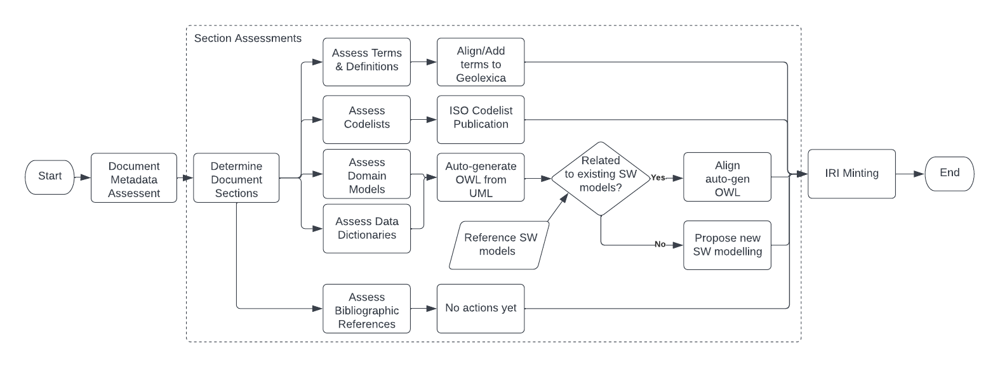

= Standards Assessment Procedure
:toc: left
:table-stripes: even
:sectnums:

== Metadata

[width=75%, frame=none, grid=none, cols="1,5"]
|===
|**IRI** | -
|**Title** | GOM Standards Assessment Procedure
|**Definition** | This document describes the procedure undertaken by Advisory Group 6 - Group on Ontology Management (GOM) to assess candidate ISO TC211 standards' Semantic Web best-practice alignment.
|**Created** | 2022-03-29
|**Modified** | 2022-03-29
|**Creator** | ISO Technical Committee 211's Advisory Group 6
|**Publisher** | _not officially published_
|**License** | _not licensed for use_
|**Further information** | See GOM's working repository for all documents and data: https://github.com/ISO-TC211/GOM
|===

== Preamble

=== Foreward

ISO (the International Organization for Standardization) is a worldwide federation of national standards bodies (ISO member bodies). The work of preparing International Standards is normally carried out through ISO technical committees. Each member body interested in a subject for which a technical committee has been established has the right to be represented on that committee. International organizations, governmental and non-governmental, in liaison with ISO, also take part in the work. ISO collaborates closely with the International Electrotechnical Commission (IEC) on all matters of electrotechnical standardization.

Any trade name used in this document is information given for the convenience of users and does not constitute an endorsement.

This document was prepared by Advisory Committee 6 within the ISO/TC 211, _Geographic information/Geomatics_.

Any feedback or questions on this document should be directed to Advisory Group 6. See their public working code repository for direct contact details:

https://github.com/ISO-TC211/GOM

=== Introduction

Advisory Group 6 - Group on Ontology Management (GOM) - undertakes assessments of ISO TC211 standards' from a "Semantic Web point of view" in order to best position those standards' content as Semantic Web objects.

This work is forward-looking: there are currently no formal requirements for TC211 standards' content to exist as Semantic Web objects however the TC does aim to follow worldwide trends towards more Internet-based and machine-readable data and models and Semantic Web publication of standards' content is thought to assit in that mission.

This document describes the procedures that GOM undertakes to assess TC211 standards and to determine their Semantic Web alignment or at least possibility for alignment.

[NOTE]
This procedure is a _work in progress_. It is being established over the course of 2022 and is open to, and certainly will, change.

== Semantic Web Standards Assessment

=== Scope

GOM was established to enhance the Semantic Web value of TC211 standards. The set of tasks that this remit entails is still in development however the assessment of TC211 standards documents "from a Semantic Web point of view" has always been assumed to be one of the major tasks.

This document indicates the developing assessment process that GOM is following.

The assessments that GOM undertakes are aiming to be as open as possible and there is no restriction on the sharing of these assessment procedures.

It is hoped that, in time, these procedures will be reviewed by standards creators early in the lifecycle of standards as this will ease standards' adopting Semantic Web best practice.

== Normative references

[NOTE]
This document is not a normative ISO TC211 document, therefore no normative references are given here.

== Terms & Definitions

For the purposes of this document, the following terms and definitions apply.

=== Linked Data

Linked Data is the web of data constructed with hyperlinks referencing <<Resource Description Framework>> data across the Internet.

SOURCE: Tim Berners-Lee _Design Issues: Linked Data_ (2006). https://www.w3.org/DesignIssues/LinkedData.html

Linked Data lies at the heart of what the <<Semantic Web>> is all about: large scale integration of, and reasoning on, data on the Web.

SOURCE: https://www.w3.org/standards/semanticweb/data

=== Resource Description Framework

The Resource Description Framework (RDF) is a framework for representing information in the Web. RDF graphs are sets of subject-predicate-object triples, where the elements may be IRIs, blank nodes, or datatyped literals. They are used to express descriptions of resources.

SOURCE: World Wide Web Consortium, RDF 1.1 Concepts and Abstract Syntax, W3C Recommendation (25 February 2014). https://www.w3.org/TR/rdf11-concepts/

=== Semantic Web

The term "Semantic Web" refers to the https://w3.org[World Wide Web]’s vision of the Web of <<Linked Data>>. Semantic Web technologies enable people to create data stores on the Web, build vocabularies, and write rules for handling data. Linked data are empowered by technologies such as RDFfootnote:[https://www.w3.org/RDF/], SPARQLfootnote:[https://www.w3.org/TR/sparql11-query/], OWLfootnote:[https://www.w3.org/TR/owl2-overview/], and SKOSfootnote:[https://www.w3.org/TR/skos-reference/].

SOURCE: https://www.w3.org/standards/semanticweb/

== Standards Assessment Procedure

Upon invitation to review a proposed Standard, GOM will follow the workflow show in <<procedure-overview>>

[id=procedure-overview]

The essence of the workflow is that Standards documents comprise multiple sections which require related but separate Semantic Web assessments. The rationale for this assessment is that Standards documents are highly regular in that they consist of common and predictable sections and that no one Semantic Web model can sensibly represent all the concerns of a Standard, other than at a superficial structural level - a document structural, not a content, model.

[NOTE]
====
This rationale was established within an Open Geospatial Consortium (OGC) project which considered the potential for the OGC to produce Semantic Web model-driven standards <<tb17>>. OGC standards are similar in structure, but not identical to, TC 211 standards.

Suggested enhancements to ISO Standards in line with recent enhancements to improve the Semantic Web positioning of OGC Standards are part of this Standards Assessment Procedure.
====

=== Document Metadata Assessment

In this assessment, the metadata of the Standard document will be assessed for its compatability with potential future Semantic Web publication of the document in Semantic Web document catalogues.

[NOTE]
====
No commitment to a Semantic Web-based cataloguing of Standards documents has been made by the TC211 so this assessment is a preemptive readiness step should such a commitment be made.

It is expected that if no commitment is made, this step will act just as a general metadata check.
====

This assessment will be conducted with the _Data Catalog Vocabulary_ <<DCAT>> model as the reference Semantic Web model since it is both standardised, well-regarded and close in structure and purpose to ISO TC211's <<ISO19115>> data cataloguing standard.

#TODO: metadata model and document element details here#

=== Section Assessment

The types of sections and the forms of their assessment are given in <<Table 1>>. Note that the types of sections requiring such assessment will grow over time if/when GOM/TC211 extends the requirements for Standards' Semantic Web form.

[width=75%, frame=none, grid=none, cols="1,5"]
.Standards document sections and their corresponding Semantic Web assessments
|===
|Section | Assessment

|Terms & Definitions |
|Codelists |
|Domain Model | https://iso-tc211.github.io/GOM/standards-assessment/procedure-domain-model.html
|Bibliography |
|===

#TODO: complete sections table#

== References

[[tb17]] Car, N.J. _Testbed sub-task D143_. Chapter from Engineering Report _OGC Model-Driven Standards_. http://www.opengis.net/doc/PER/t17-D022 (https://github.com/ISO-TC211/GOM/blob/master/standards-assessment/t17-D143.pdf[local copy])

[[DCAT]] World Wide Web Consortium _Data Catalogue Vocabulary (DCAT) - revised edition_. W3C Recommendation, 25 November 2018. https://www.w3.org/TR/vocab-dcat/

[[ISO19115]] International Organization for Standardization _ISO 19115-1:2018: Geographic information – Metadata – Part 1: Fundamentals_. International standard. https://www.iso.org/standard/53798.html